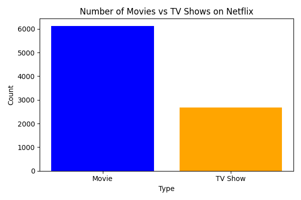
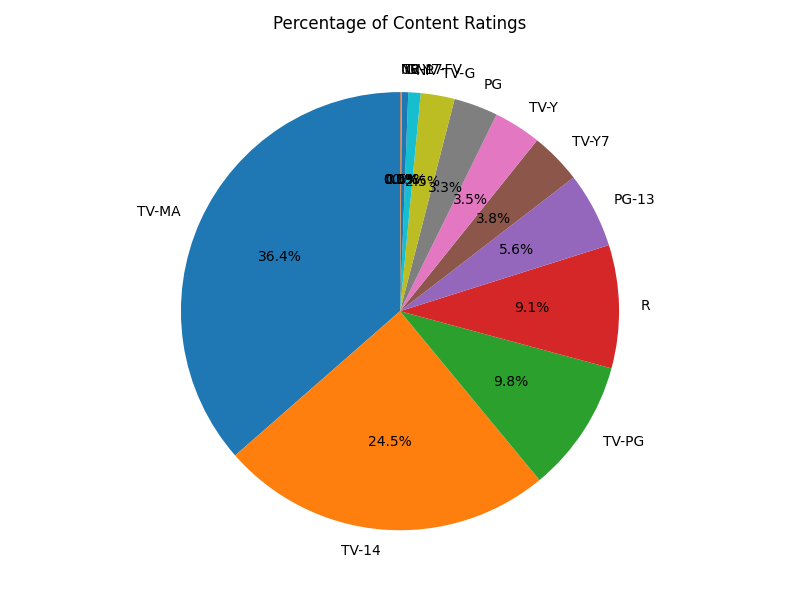
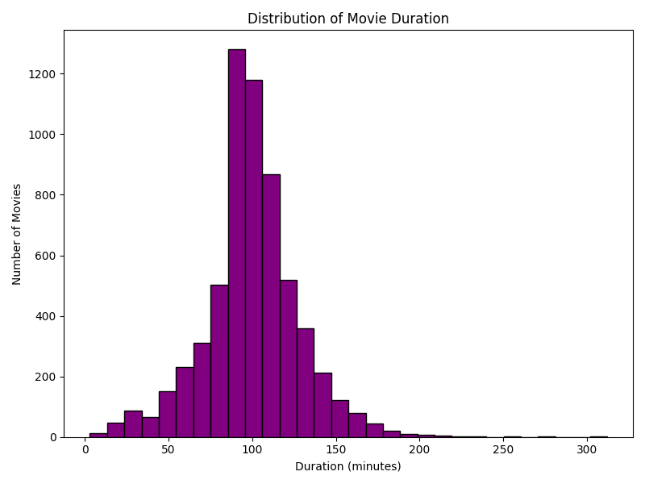

# Data-Analysis
# 📊 Netflix Data Analysis

This project explores and visualizes the Netflix dataset to gain insights into the platform's content distribution, ratings, and movie durations.  
Using **Python**, **Pandas**, and **Matplotlib**, the analysis answers key questions about what’s available on Netflix.

---

## 🚀 Project Overview
The project performs the following:
- Loads and cleans the Netflix dataset (`netflix_titles.csv`)
- Removes missing values for key columns
- Visualizes:
  1. **Number of Movies vs TV Shows**
  2. **Percentage of Content Ratings**
  3. **Distribution of Movie Durations**

---

## 📂 Dataset
- **Source**: Netflix Titles dataset (Kaggle)
- **Key Columns Used**:
  - `type` – Movie or TV Show
  - `rating` – Content rating (e.g., PG, TV-MA)
  - `duration` – Duration in minutes or number of seasons

---

## 📊 Visualizations
### 1️⃣ Movies vs TV Shows

### 2️⃣ Content Ratings

### 3️⃣ Movie Duration Distribution

---

## 🛠️ Technologies Used
- **Python**  
- **Pandas** – Data manipulation & cleaning  
- **Matplotlib** – Data visualization  

---
Nitya Patel
📧 [patelnitya351@gmail.com]
🔗 [www.linkedin.com/in/
nitya-patel-364363319
]
